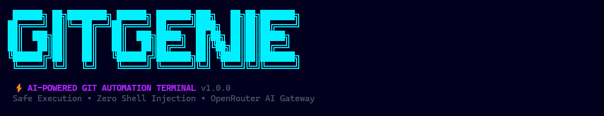

<div align="center">
  
  <br/>
  <h1>🧞‍♂️ GitGenie</h1>
  <p><b>Production-Grade AI-Powered Git Terminal Assistant</b></p>
  
  <p>
    <a href="https://www.npmjs.com/package/gitgenie"></a>
    <a href="https://nodejs.org"></a>
    <a href="https://github.com/GitGenie/gitgenie/blob/main/LICENSE"></a>
  </p>
</div>

---

GitGenie is an intelligent, completely autonomous command-line interface that translates your natural language into safe, robust Git workflows. Driven by OpenRouter LLMs and wrapped in a stunning neon UI, GitGenie turns tedious git operations into a magical, developer-friendly experience.

## ✨ Key Features

- **🧠 Autonomous AI Workflow Engine**: Just type what you want to do (e.g., `"sync my branches with remote"` or `"create a branch for auth and commit my work"`), and GitGenie plans and executes the entire structured workflow securely.
- **🎨 Beautiful Neon UI**: An incredibly sleek dark-mode terminal experience featuring neon cyan and purple accents, custom glowing spinners, ASCII art headers, and rounded completion summary cards.
- **🛡️ Built-In Policy Engine & Secret Detection**: Refuses to commit `.env` files, API keys, or destructive commands (like force pushes) unless explicitly overridden, keeping your repositories safe.
- **📜 Advanced Native Pager**: Automatically detects when Git outputs are too large for your terminal (like deep `git log` or massive diffs) and gracefully routes them into an advanced scrollable pager (retaining full ANSI colors) without flooding your screen history.
- **🤖 AI Sync Summaries**: Beautifully formatted terminal summaries automatically printed after successful `git pull`, `merge`, or `rebase` operations, intelligently summarized by the AI provider into 1-2 concise sentences.
- **⚡ Smart Conflict Resolution**: Identifies merge conflicts dynamically and leverages AI to propose code resolutions instantly.

<div align="center">
  
  <p><i>The Advanced Native Pager with full ANSI syntax highlighting.</i></p>
</div>

---

## 🚀 Installation

Install GitGenie globally via npm to access the `gitgenie` command from any directory:

```bash
npm install -g gitgenie
```

## 🛠️ Configuration

GitGenie uses OpenRouter by default to access top-tier AI models.

1. Get a free API key from [OpenRouter](https://openrouter.ai/).
2. Set up GitGenie with the interactive wizard:

```bash
gitgenie config setup
```

Or configure it manually:
```bash
gitgenie config set api-key "sk-or-v1-..."
gitgenie config set model "anthropic/claude-3.5-sonnet"
```

You can also use environment variables directly:
```bash
export OPENROUTER_API_KEY="sk-or-v1-..."
export GITGENIE_AI_MODEL="anthropic/claude-3.5-sonnet"
```

## 🪄 Usage Examples

Stop memorizing complex git flags. Just talk to your repository.

**Start a new project:**
```bash
gitgenie "Initialize a git repo here and setup a Node.js gitignore"
```

**Daily Workflow:**
```bash
gitgenie "Create a new branch called feature/payment, stage everything, and commit my work"
```

**Syncing & Pulling:**
```bash
gitgenie "Sync my branches with the remote origin"
```

**Smart Diffs & Pager:**
```bash
gitgenie "Show me the detailed differences between main and feature/payment"
```

## ⚙️ CLI Flags

```text
USAGE:
  gitgenie "<natural language request>" [flags]
  gitgenie config <subcommand>

OPTIONS:
  --dry-run      Plan and validate actions without executing them
  --verbose      Display verbose debug logs
  --no-color     Disable ANSI colors (honors NO_COLOR=1)
  -y, --yes      Auto-confirm non-destructive prompts
  -v, --version  Show version number
```

## 🤝 Contributing

We welcome contributions! Please open an issue or submit a pull request if you have ideas for new workflows, UI enhancements, or AI integrations.

1. Clone the repository
2. Run `npm install`
3. Run `npm run dev` to test locally
4. Make sure tests pass using `npm run test`

## 📄 License

MIT © GitGenie Team
